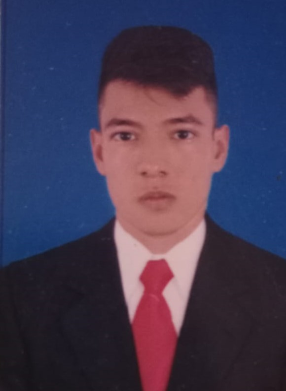

# Hola 👋, soy Alejandro Cendales
---

  

\

## Perfil

---

Hola, soy Nicolás Vanegas. Actualmente, estoy estudiando Ingeniería Electrónica en el décimo semestre en la Universidad de los Llanos de Villavicencio, Colombia. Mis principales áreas de investigación son los sistemas electrónicos, la automatización industrial, Internet de las cosas, aprendizaje automático, ciencia de datos, y temas afines. 

A lo largo de mi carrera, he adquirido conocimientos tanto teóricos como prácticos en la elaboración de circuitos electrónicos y de potencia. También he sido monitor de cálculo univariado y ecuaciones diferenciales, y he desarrollado una base sólida para la investigación, así como habilidades en lenguajes de programación como Python, C, C++, Matlab y LabVIEW. He programado varios microcontroladores, como Arduino, ESP32 y ESP8266, así como microprocesadores como Raspberry Pi. sobre automatización tengo experiencia en automatización con PLC y Logo Software.

---
## Educación

 - Bachillerato Colegio INEM Luis López de mesa (2011-2017)

 - Pregrado Ingeniería electrónica Universidad de los Llanos Universidad de los Llanos (2018 - Actualmente)

---
## Experiencia

 - **2020-2, Tutor del curso Ecuaciones diferenciales
Universidad de los Llanos:** 

   Tutor de acompañamiento al profesor en la enseñanza del curso de Ecuaciones Diferenciales en el semestre 2020-2.

- **2021-1, Tutor del curso Calculo Integral
Universidad de los Llanos:** 

   Tutor de acompañamiento al profesor en la enseñanza del curso de Calculo integral en el semestre 2021-1.

- **Actualmente, Pasante en el grupo Mandelbrot**

    Pasante en el grupo de investigación *Rejewski security labs* vinculado al desarrollo de iniciativas en tecnologías de la información y las comunicaciones enfocadas en ciberseguridad

### **Software:**
-   
- 
- 	 
- 

- MATLAB
- LabVIEW
- Logo! Software  

---
## Contacto
📞 3014464740

   Gmail:     [nicolax0608@gmail.com](https://mail.google.com/mail/u/0/#inbox?compose=GTvVlcSHwQhSMNSWGRtZZPRCvDwvpXVLrfSvKlpMCdsVbTFbmcDLslScMJLNCWGHHFhgtRQGZWVrS "mail") 
   \
   Celular:      [3209288821](https://api.whatsapp.com/send?phone=573209288821  "Telephone or Whatsapp")           
   GitHub:      [Nicovaro8](https://github.com/Nicovaro8 "Github profile")              
    
